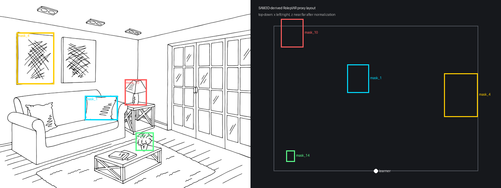
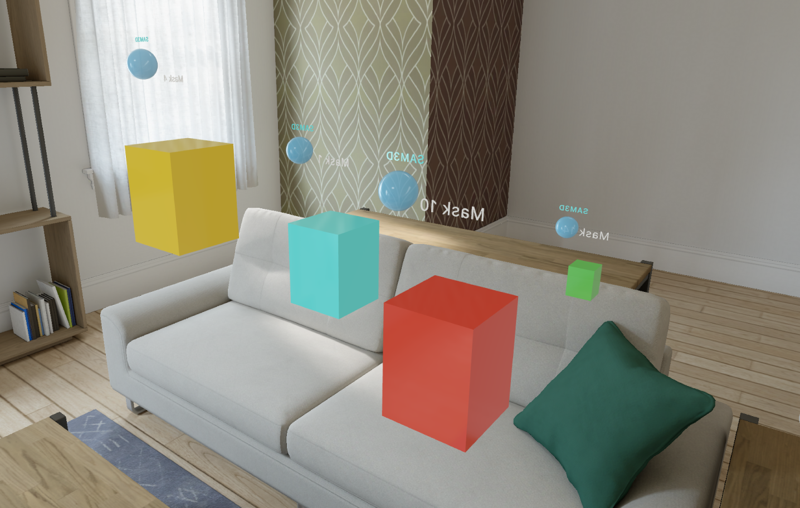

# May 22 Checkpoint: Generated Interaction Worlds

## Goal

The project goal is to build an LLMR-inspired pipeline for RoleplAR: given a language-learning scenario card, generate an executable interactive scene that a learner can act in on Apple Vision Pro.

The second checkpoint focuses on meaningful intermediate results under the evaluation framework from checkpoint 1. The main progress is that the missing generation stages are now implemented: object/layout generation and typed interaction-task generation.

## Current Pipeline

```text
ScenarioCard
  -> Step 1: LLM generates WorldObjectSpec objects
  -> Step 2: RealityKit renders primitive/generic proxies
  -> Step 3: LLM generates InteractionTask objects
  -> Step 4: InteractionWorldRuntime validates the plan
  -> Step 5: Runtime processes native/mock interaction events
  -> Step 6: Automatic + manual evaluation records successes and failures
```

The current renderer still uses primitive proxies. That is intentional for this stage: it lets the evaluation focus on whether generated scene structure and interactions are valid before realistic object assets are integrated.

## Refined Evaluation

The first checkpoint established evaluation infrastructure. Since then, the evaluation has been sharpened to separate three sources of failure:

| Evaluation question | What it measures |
| --- | --- |
| Primitive coverage | Whether the intended interaction can be expressed with `indicate`, `tap`, `drag`, `place`, or `gesture`. |
| LLM planning quality | Whether the LLM chooses appropriate objects, positions, primitive types, target object ids, and task ordering. |
| Runtime/realization quality | Whether the validated plan renders, executes, and feels spatially/visually sufficient in the simulator. |

This matters because a failed interaction is not automatically an LLM failure. It may instead reveal a primitive-vocabulary gap, visual-realization gap, spatial-layout gap, affordance gap, perception/detection gap, or runtime bug.

## Implemented Since Checkpoint 1

- `InteractionWorldGenerator` now runs the two-call structured-output pipeline: objects first, tasks second.
- The generator records attempts, raw JSON, outcomes, validation failures, and total generation time.
- Generated plans are retried up to three times, then recorded as failures rather than blocking evaluation.
- `WorldObjectSpec` supports open-description/generic objects so generated scenes are not limited to the original cafe enum cases.
- The RealityKit renderer handles generic object categories as primitive proxies.
- The Interaction World UI exposes generation controls, attempt status, export logs, and manual evaluation.
- Manual evaluation now covers object realization, spatial layout, scenario fidelity, primitive faithfulness, affordance instrumentation, and task completion.
- A SAM3D service contract and mock bridge were added for future visual realization.

## Intermediate Results

| Result | Evidence | Status |
| --- | --- | --- |
| Cafe upper-bound baseline | Hand-authored cafe plan with 7 objects and 5 tasks | Runs in simulator; task ordering and interaction handlers work. |
| Generated primitive-plan pipeline | Step 1 + Step 3 generator, validation, generation tests | Implemented; ready to run across the 9-scenario benchmark. |
| Manual evaluation UI | Simulator panel | Running; supports yes/partial/no ratings and metric descriptions. |
| SAM3D single-object smoke test | `tools/sam3d_service/CHECKPOINT_2_SAM3D_BRIDGE.md` | Real GCP L4 SAM3D inference produced a `9.3 MB` Gaussian splat after setup. |
| SAM3D layout signal test | `results/checkpoint2/sam3d_layout_signal` | Four object masks produced four `.ply` splats plus pose/scale metadata. RoleplAR can load the derived layout plan as primitive proxies. |

## SAM3D Layout Signal Result

The SAM3D spike asks whether generated/segmented object assets can provide layout signals for RoleplAR. This is a visual-realization experiment, not the main interaction-planning method yet.

Input:

- SAM3D example room image.
- Four cleaned object masks: `1`, `4`, `10`, `14`.

Output:

- Four object-level Gaussian splats: `mask_1.ply`, `mask_4.ply`, `mask_10.ply`, `mask_14.ply`.
- `layout_signal_report.json` with per-object translation, scale, rotation, image bounding boxes, and normalized RoleplAR proxy candidates.
- `layout_signal_summary.csv` as the compact evaluation table.
- `roleplar_layout_plan.json`, which RoleplAR can load through the bridge service.

Debug view:



Loaded in RoleplAR:



Interpretation:

- The bridge works technically: object-level SAM3D outputs can be converted into RoleplAR plan objects and loaded in the simulator.
- The app currently renders primitive proxies at SAM3D-derived positions while preserving `.ply` asset metadata.
- The placement is not yet semantically or metrically reliable. This becomes a concrete layout-calibration failure mode for the final evaluation.

## Artifacts

Checkpoint artifacts are in [results/checkpoint2](results/checkpoint2):

- [results/checkpoint2/sam3d_layout_signal/layout_signal_debug.png](results/checkpoint2/sam3d_layout_signal/layout_signal_debug.png)
- [results/checkpoint2/sam3d_layout_signal/roleplar_loaded_layout.png](results/checkpoint2/sam3d_layout_signal/roleplar_loaded_layout.png)
- [results/checkpoint2/sam3d_layout_signal/layout_signal_summary.csv](results/checkpoint2/sam3d_layout_signal/layout_signal_summary.csv)
- [results/checkpoint2/sam3d_layout_signal/layout_signal_report.json](results/checkpoint2/sam3d_layout_signal/layout_signal_report.json)
- [results/checkpoint2/sam3d_layout_signal/roleplar_layout_plan.json](results/checkpoint2/sam3d_layout_signal/roleplar_layout_plan.json)

The large `.ply` files are included as generated SAM3D object artifacts.

## How To Run

Open `RoleplAR.xcodeproj` and run the `RoleplAR` scheme on an Apple Vision Pro simulator.

For live LLM generation:

1. Add `OPENAI_API_KEY` to the Xcode scheme environment.
2. Open `Interaction World`.
3. Generate or load a scenario plan.
4. Open the micro-world.
5. Fill in the manual evaluation panel.

For the SAM3D layout artifact:

```bash
cd tools/sam3d_service
python3 mock_service.py --host 127.0.0.1 --port 8010 --layout-plan layout_signal_outputs/roleplar_layout_plan.json
```

Then:

```text
Interaction World -> Load SAM3D Layout Plan -> Open Micro-world
```

## Current Limitations

- The full 9-scenario benchmark still needs to be run end-to-end.
- The current generated scenes use primitive proxies rather than realistic generated assets.
- SAM3D `.ply` splats are saved and linked as metadata, but not directly rendered inside RealityKit.
- SAM3D pose/scale transfer is technically possible but not yet reliable enough for accurate room layout.
- Gesture primitives are still mock-driven for simulator testing.

## Next Steps

1. Run Step 1 and Step 3 generation across all 9 GELLI-derived scenarios.
2. Fill the coverage matrix with per-interaction labels: faithful, compromise, missed, invalid.
3. Separate failures by source: primitive vocabulary, LLM planning, visual realization, spatial layout, perception/detection, or runtime.
4. Improve layout calibration or replace SAM3D-derived placement with a planner/object-placement stage.
5. Decide whether generated assets should enter RoleplAR as mesh/USDZ, splat-rendered visuals, or primitive-collider proxies with separate visual skins.

## Verification

Build command:

```bash
DEVELOPER_DIR=/Applications/Xcode.app xcodebuild \
  -project /Users/dlonzell/Documents/New\ project/cs348k_dlonzell/RoleplAR.xcodeproj \
  -scheme RoleplAR \
  -destination 'generic/platform=visionOS Simulator' \
  -derivedDataPath /private/tmp/cs348k-checkpoint2-build \
  build
```

Test files to inspect:

- `RoleplARTests/InteractionWorld/InteractionWorldRuntimeTests.swift`
- `RoleplARTests/InteractionWorld/InteractionWorldGenerationTests.swift`
