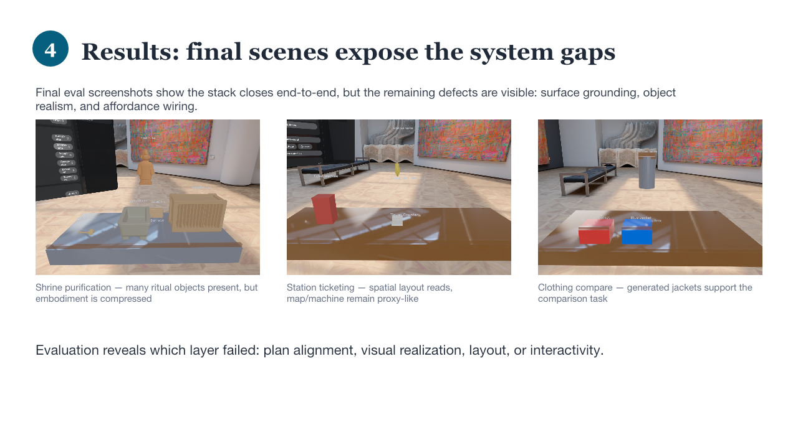
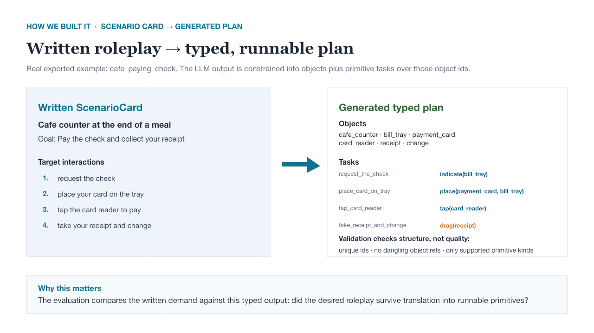
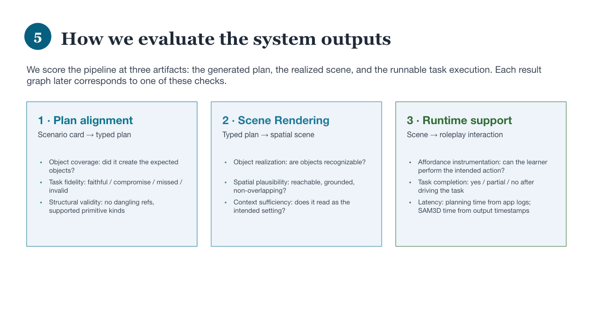
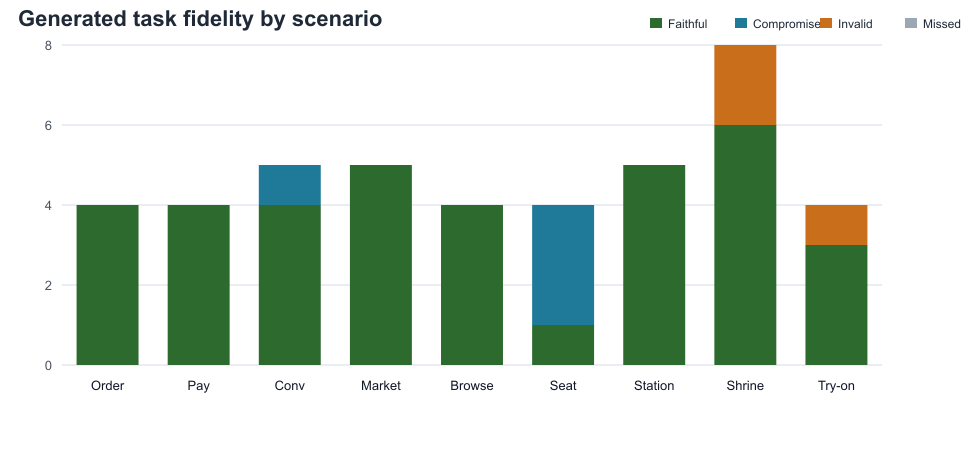
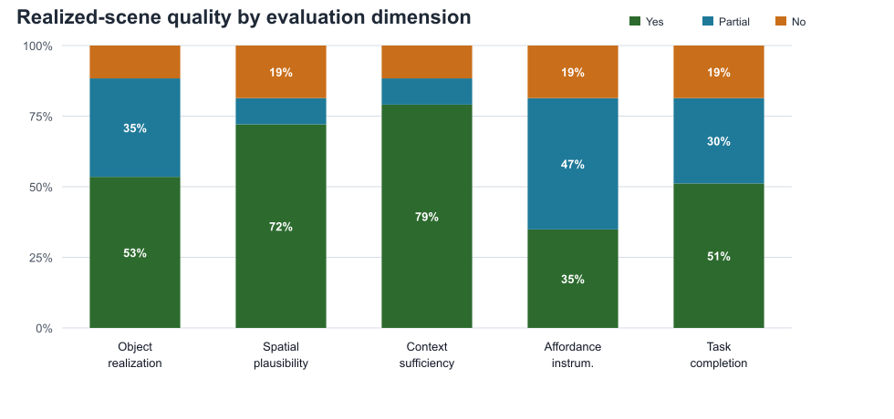
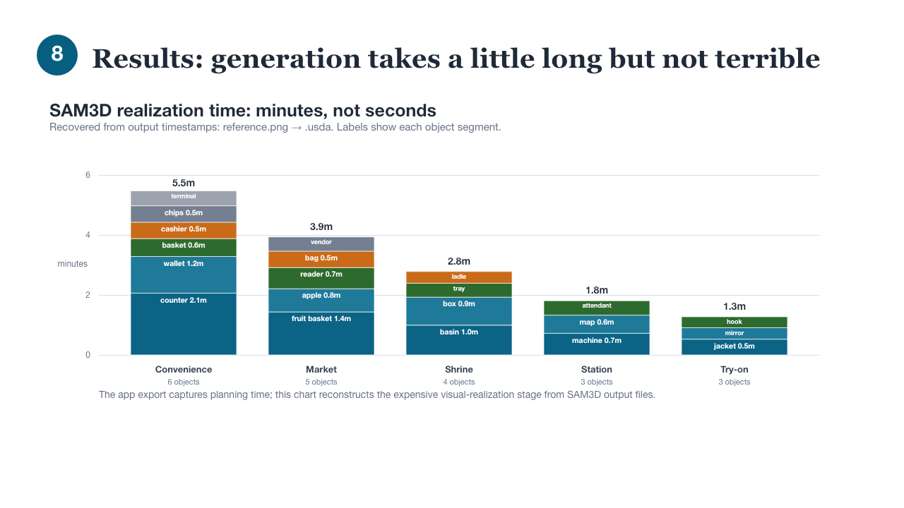
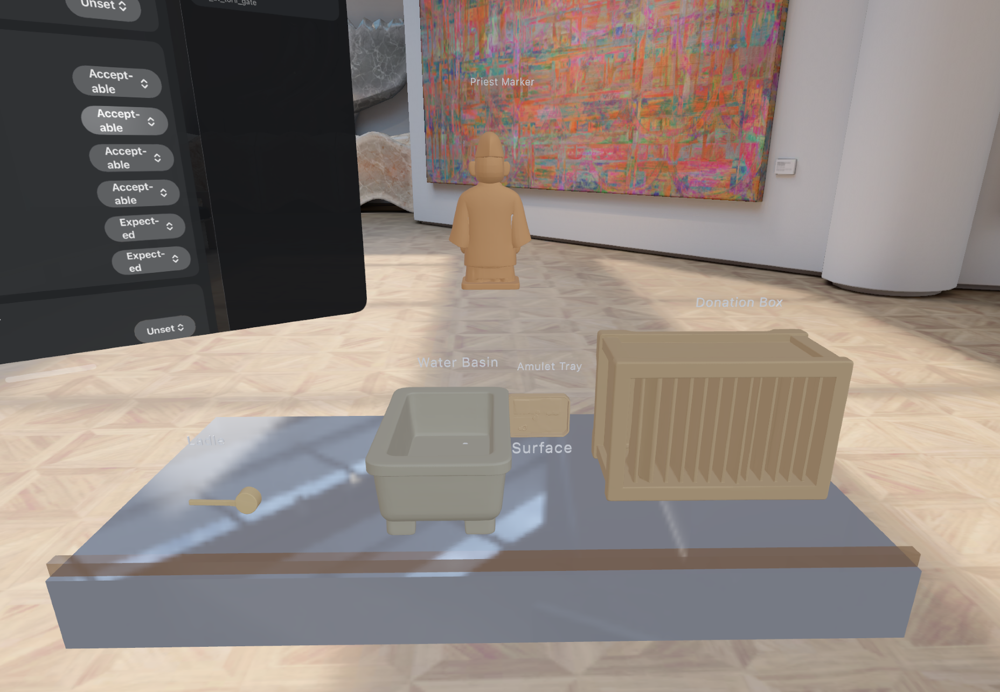
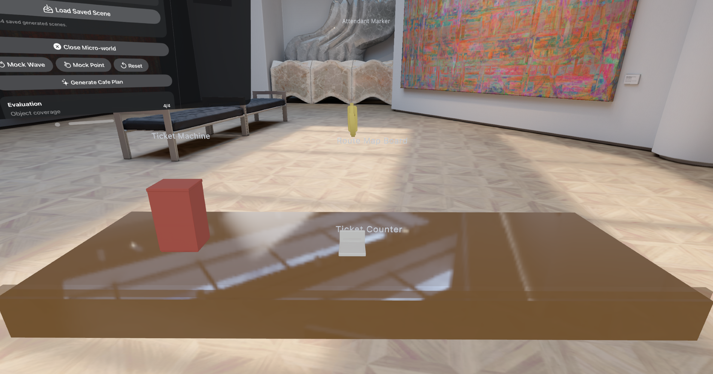
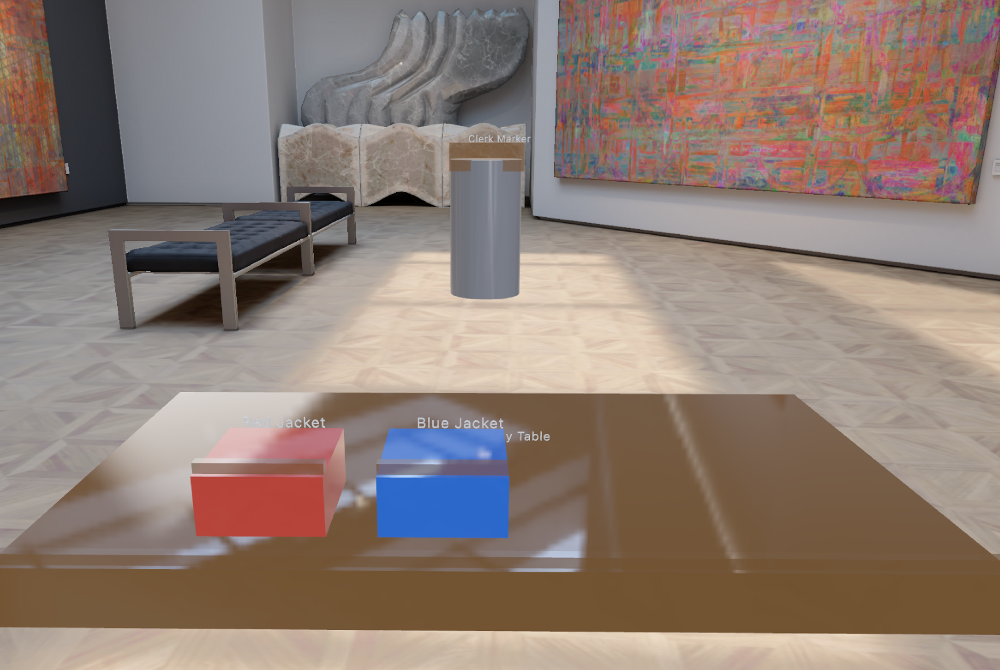

# From Scenario to Scene

**Generating interactive language-learning practice scenes for Apple Vision Pro**  
CS348K Final Project

**Danilo Lonzell**  
Stanford email: `dlonzell@stanford.edu`

Final presentation: [docs/final/348kpres.pptx](docs/final/348kpres.pptx)  
Checkpoint writeups: [May 8](CHECKPOINT_MAY8.md), [May 22](CHECKPOINT_MAY22.md)

---

## Summary

This project builds an LLMR-inspired pipeline that takes a written language-learning scenario card and generates a runnable spatial roleplay scene for Apple Vision Pro. The system translates the written card into a typed object-and-task plan, realizes selected objects with SAM3D on a remote GPU service, lays the assets out in a scene, and evaluates where the generated roleplay succeeds or breaks.



---

## Background and Setup

### Problem

Language-learning roleplay systems often describe physical actions in text: asking for the check, pointing at a menu, placing a card on a tray, comparing two jackets, or performing a purification ritual. In a spatial computing setting, those actions should be grounded in visible, manipulable objects. The goal of this project is to explore whether a written roleplay scenario can become an executable Vision Pro micro-world quickly enough to be useful for practice.

### Inputs and Outputs

**Input:** a `ScenarioCard` with natural-language fields:

- setting
- learner role
- scene goal
- local context
- target interactions
- expected object categories

**Output:** a runnable `InteractionWorldPlan`:

- named objects with stable ids
- typed primitive interaction tasks over those object ids
- reconstructed or proxy visual assets
- layout metadata
- RealityKit entities with colliders and interaction handlers
- evaluation logs for plan quality, scene quality, task completion, and timing

### Goals and Constraints

The target system was constrained by three design goals:

1. **Native Vision Pro interaction.** The app should run as a visionOS spatial scene using gaze/pinch, object manipulation, and simple gestures.
2. **Runnable plans instead of arbitrary code.** Apple platform constraints and demo reliability made runtime code generation a bad fit, so the LLM output is a typed, validated plan rather than behavior code.
3. **Few-minute workflow.** A useful roleplay generator should produce a scene quickly enough to iterate on, which made latency and fallback behavior part of the systems problem.

### Question

Given a written language-learning scenario, can a structured-output LLM plus object reconstruction pipeline generate a runnable spatial roleplay scene, and where does it fail: in the plan, the visual realization/layout, or the runtime affordances?

### Technical Challenges

Turning a symbolic plan and independently generated assets into a coherent, reachable, interactable scene was not straightforward. Existing approaches did not meet our constraints (code gneration can't run at runtime on a headset for example). Raw generated coordinates frequently placed objects on the floor, floating, overlapping, or scattered in ways that broke the roleplay. The project therefore needed a deterministic layout pass that assigned object roles, inferred relations from the task queue, snapped objects to support surfaces, repaired overlaps, and kept the typed interaction affordances attached to the rendered scene (inspired by the approach in Holodeck paper) 

---

## Approach

### 1. Written Roleplay to Typed Plan

The system deliberately separates plan generation into stages:

1. **LLM to objects.** Generate `WorldObjectSpec` objects with ids, descriptions, kinds, positions, sizes, colors, and interactivity flags.
2. **LLM to tasks.** Given the generated objects, generate `InteractionTask` steps using only the supported primitive vocabulary.
3. **Validation.** Reject structurally unrunnable plans: duplicate ids, dangling object references, or unsupported primitive kinds.

The primitive vocabulary is:

- `indicate(objectId)`
- `tap(objectId)`
- `drag(objectId)`
- `place(objectId, targetId)`
- `gesture(wave|point|thumbsUp|openPalm, targetId?)`

The real exported cafe-paying example shows the core translation:



For `cafe_paying_check`, the written target interaction "place your card on the tray" became `place(payment_card, bill_tray)`, while "take your receipt and change" became the lossy primitive `drag(receipt)`. This distinction is important: validation can say a plan is runnable, but the evaluation still asks whether the roleplay survived the translation.

### 2. Typed Plan to Realized Scene

The plan is then sent through a visual realization path:

```text
Scenario card
  -> generated object/task plan
  -> selected objects sent to SAM3D service
  -> reference image, mask, 3D reconstruction, USDA asset
  -> VLM canonical pose hints
  -> RealityKit asset/proxy scene
```

SAM3D supplies object assets, not a complete semantic scene graph. For each selected object, the service produces artifacts such as:

- `object_reference.png`
- `object_mask.png`
- `object.ply`
- `object.usda`

It also produced canonical pose hints such as "up" and "front" for assets. Those hints help orient objects, but they do not decide where the objects belong in the roleplay. Scene placement is handled by the layout solver.

### 3. Layout Solver

The layout solver is the project's simplified,  analogue of a Holodeck-style layout plan. Instead of trusting raw LLM coordinates, it uses the semantic structure of the generated plan.

The solver:

1. finds or inserts a support surface;
2. classifies objects as source objects, target containers, payment devices, upright context objects, person markers, or surfaces;
3. infers spatial relations from the task queue;
4. snaps props onto the support surface;
5. places person markers behind the surface;
6. clamps objects within surface bounds;
7. repairs surface overlaps;
8. attaches asset metadata such as `supportSurfaceId`, `targetSize`, and `restingPolicy`.

This transformed rough LLM placement into a more coherent scene, but it did not solve all layout problems. The final evaluation still shows partial spatial and affordance failures.

---

## Scenario Workload

The benchmark contains nine scenarios drawn from the prior GELLI language-learning study context: cafe, shopping, and open-ended cultural/travel situations. The scenarios were selected from interactions where learners wanted physical referents or actions in the scene, such as pointing at items, placing objects, paying, comparing clothing, using a ticket machine, or performing a ritual.

The final scenario set:

| Scenario | Purpose |
| --- | --- |
| Convenience store checkout | Dense transactional flow using most primitives |
| Farmers market stand | Produce selection and object placement |
| Cafe arrival/seating | Spatial roleplay and locomotion gap |
| Cafe ordering | Menu/pastry deixis and confirmation |
| Cafe paying check | Payment tray, card reader, receipt exchange |
| Clothing browse/compare | Side-by-side object comparison |
| Clothing trying-on | Pick-up/place plus wearing/locomotion gap |
| Station ticketing | Route map and ticket-machine breadth case |
| Shrine purification | Ritual sequence and embodied-action stress case |

---

## Evaluation and Results

### Definition of Success

The system succeeds to the extent that it can:

1. translate written roleplay demands into a valid typed plan;
2. realize and lay out recognizable objects in a plausible spatial scene;
3. wire the scene so the learner can complete the intended primitive tasks;
4. do so within a latency budget compatible with iteration.

The evaluation therefore scores the pipeline at three artifacts: the generated plan, the realized scene, and the runnable task execution.



### Plan Alignment

At the plan level, the generator performed well. Across the final evaluation bundle:

- 9/9 exported scenarios produced validated typed plans.
- 42 generated objects were rated expected.
- 4 generated objects were rated acceptable.
- 0 generated objects were rated hallucinated.
- 36/43 generated task mappings were faithful.
- 40/43 were faithful or acceptable compromises.
- 3/43 were invalid primitive mappings.



The main interpretation is that LLM planning was not the dominant bottleneck. The system usually created the right object inventory and mapped written interactions to plausible primitive tasks. The remaining invalid mappings concentrated in embodied or roleplay-rich actions such as bowing, clapping, wearing clothing, locomotion, and bidirectional exchange.

### Realized Scene Quality

The scene-level evaluation separates visual/spatial quality from task execution:

- **Object realization:** are the required objects visible and recognizable?
- **Spatial plausibility:** are objects grounded, reachable, non-overlapping, and arranged sensibly?
- **Context sufficiency:** does the scene read as the intended setting?
- **Affordance instrumentation:** are objects wired for the required primitive interactions?
- **Task completion:** could the task actually be completed or partially completed?



Object, context, and spatial plausibility were often usable, but affordance instrumentation and task completion were more frequently partial. This supports the main result: the typed plan often survives, but turning the plan into an interactable spatial scene remains the hard part.

### SAM3D Timing

The app evaluation logs captured LLM plan-generation time, with a median around 9.5 seconds for timing-included logs. SAM3D realization timing was reconstructed from output file timestamps, using `reference.png -> .usda` per object. This does not include model preload, app polling, or all queueing overhead, but it captures the dominant reconstruction/export cost.



The timing result is clear: planning was seconds; visual realization was minutes. Multi-object scenes required several minutes because each object was reconstructed and exported separately. 

### What Worked

The pipeline closes end to end:

```text
written scenario card
  -> typed object/task plan
  -> validated runnable primitive plan
  -> SAM3D/proxy object realization
  -> layout
  -> interactable scene with evaluation logs
```

The plan-level results are strong enough to show that a typed-plan approach is viable. The system avoids arbitrary code generation while still producing evaluable spatial interaction plans.

### What Did Not Work

The main limitations were downstream of planning:

- generated assets were uneven in visual quality;
- surface-like objects could be slow or visually poor;
- layout improved but still required careful support-surface handling;
- affordance instrumentation was brittle;
- the primitive vocabulary lacks richer embodied gestures, locomotion, wearing/trying-on, and bidirectional exchange.

These are not all failures of the LLM. Some are vocabulary gaps, some are layout/realization gaps, and some are runtime affordance gaps. The evaluation was designed to attribute those failures instead of collapsing them into one score.

---

## Demonstration Artifacts

Presentation deck:

- [Final presentation PPTX](docs/final/348kpres.pptx)

Rendered slide gallery:

- [Slide 1](docs/final/assets/slides/source-slide-01.png)
- [Slide 5: written to typed plan](docs/final/assets/slides/source-slide-05.png)
- [Slide 9: final scene examples](docs/final/assets/slides/source-slide-09.png)
- [Slide 11: plan alignment](docs/final/assets/slides/source-slide-11.png)
- [Slide 12: realized scene quality](docs/final/assets/slides/source-slide-12.png)
- [Slide 13: SAM3D timing](docs/final/assets/slides/source-slide-13.png)

Selected scene screenshots:





Evaluation data:

- [Final eval manifest](docs/final/data/manifest.json)
- [Evaluation summary](docs/final/data/eval_summary.json)
- Per-scenario exported JSON logs in [docs/final/data](docs/final/data)

Note: the final data folder preserves the exported evaluation bundle used for the presentation figures. Entries marked as simulated in the manifest should be interpreted as simulation-backed presentation/evaluation artifacts, not as independent headset trials.

---

## Team Responsibilities

This was an individual project. I implemented the RoleplAR interaction-world data model, primitive runtime, validation path, LLM generation pipeline, evaluation UI/log export, SAM3D service integration, layout solver, scenario presets, final evaluation, and presentation/report materials.

---

## How to Run

Open the project in Xcode:

```bash
open RoleplAR.xcodeproj
```

Run the `RoleplAR` scheme on a visionOS simulator. To enable live LLM plan generation, set `OPENAI_API_KEY` in the Xcode scheme environment.

For SAM3D-backed realization, run the remote/local service described in:

- [tools/sam3d_service/README.md](tools/sam3d_service/README.md)

The final project used a remote GPU VM for SAM3D object reconstruction and a Cloudflare tunnel for app-to-service requests.

---

## References

- De La Torre, F., Fang, C. M., Huang, H., Banburski-Fahey, A., Amores Fernandez, J., & Lanier, J. **LLMR: Real-time Prompting of Interactive Worlds using Large Language Models.**
- Yang et al. **Holodeck: Language Guided Generation of 3D Embodied AI Environments.** CVPR 2024.
- Meta. **SAM 3D Objects.**
- Apple. **RealityKit and visionOS documentation.**
- Prior GELLI language-learning study data used to derive the scenario workload.
